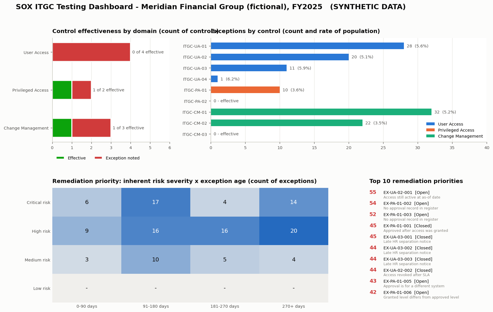

# SOX ITGC Testing Simulation

> ⚠️ **All data in this project is synthetic.** "Meridian Financial Group", its employees, systems, tickets and
> changes are fictional and were generated by `src/phase2_generate_data.py`. Nothing here reproduces a real
> company's RCM, controls or results.

**Live dashboard:** https://sox-itgc-testing-simulation.vercel.app

This project runs a full-year **SOX 404 IT General Controls (ITGC) test cycle** the way an ICFR testing team
would. It maps financial-reporting risks to controls, tests each control against its full population with
Python and SQL, writes audit workpapers from the results, and ranks every exception for remediation.



---

## Where to start

1. **The dashboard** ([live site](https://sox-itgc-testing-simulation.vercel.app) or the image above) shows which
   controls failed, how badly, and what to fix first.
2. **One workpaper:** [`WP-UA-02 Timely revocation of terminated users`](outputs/workpapers/WP-UA-02_Timely_revocation_of_terminated_users.docx),
   covering objective, population and IPE checks, approach, procedures, results, conclusion and remediation.
3. **The RCM:** [`outputs/rcm/SOX_ITGC_RCM.xlsx`](outputs/rcm/SOX_ITGC_RCM.xlsx).
4. **How the tests were validated:** the [validation](#how-the-testing-logic-was-validated) section below.

## Results (FY2025, full-population testing)

| Control | Domain | Population | Exceptions | Rate | Open | Conclusion |
|---|---|---:|---:|---:|---:|---|
| ITGC-UA-01 New user access approval | User Access | 501 | 28 | 5.6% | 0 | Exception noted |
| ITGC-UA-02 Terminated user revocation (5 BD) | User Access | 392 | 20 | 5.1% | 11 | Exception noted |
| ITGC-UA-03 HR separation notification (1 BD) | User Access | 185 | 11 | 5.9% | 0 | Exception noted |
| ITGC-UA-04 Quarterly user access review | User Access | 16 | 1 | 6.3% | 0 | Exception noted |
| ITGC-PA-01 Privileged access authorization | Privileged Access | 280 | 10 | 3.6% | 5 | Exception noted |
| ITGC-PA-02 Independent privileged approval | Privileged Access | 275 | 0 | 0.0% | 0 | **Effective** |
| ITGC-CM-01 Change approval before implementation | Change Mgmt | 620 | 32 | 5.2% | 0 | Exception noted |
| ITGC-CM-02 Documented rollback plan | Change Mgmt | 620 | 22 | 3.5% | 0 | Exception noted |
| ITGC-CM-03 Change segregation of duties | Change Mgmt | 610 | 0 | 0.0% | 0 | **Effective** |

**Headline finding:** the terminations chain (UA-03 → UA-02) is the most significant theme. 20 grants belonging
to 14 terminated employees were not revoked within 5 business days, and 11 of those grants were still active at
the as-of date. 6 of the 14 employees also had a late HR separation notice, which points to the HR-to-IT hand-off
as a root cause.

## Methodology

| Phase | What it produces | Code |
|---|---|---|
| 1. Risk & Control Matrix | 5 risks (likelihood × impact severity), 9 controls with owner, frequency, type, nature, key flag, population, test attribute and procedure | [`src/rcm_definitions.py`](src/rcm_definitions.py), [`src/phase1_build_rcm.py`](src/phase1_build_rcm.py) |
| 2. Synthetic data | 1,250 employees, 2,706 access grants, 185 terminations, 328 privileged approvals, 16 access reviews, 620 changes. Seeded exceptions go to [`answer_key/`](answer_key/) | [`src/phase2_generate_data.py`](src/phase2_generate_data.py) |
| 3. Control testing | Full-population tests in **pandas** and in **SQL** (SQLite with a business-day calendar) → one traceable exception row per failure | [`src/phase3_test_controls.py`](src/phase3_test_controls.py), [`sql/`](sql/), [`src/phase3_sql_tests.py`](src/phase3_sql_tests.py) |
| 4. Workpapers | 9 Word workpapers plus a summary memo. Every number is computed from the Phase 3 output | [`src/phase4_workpapers.py`](src/phase4_workpapers.py) |
| 5. Dashboard | Web dashboard ([`site/`](site/)), static PNG, and a Power BI star schema with DAX measures ([`outputs/powerbi/`](outputs/powerbi/)) | [`src/phase5_dashboard.py`](src/phase5_dashboard.py) |
| 6. Documentation | This README | |

### Scope decisions

These are the defaults I chose for scope and policy. All of them are in [`src/common.py`](src/common.py) and the
`Policy Parameters` sheet of the RCM.

- **Entity / period:** fictional mid-size bank, FY2025 (1 Jan – 31 Dec 2025). Fieldwork as-of date is 30 Jan 2026,
  and open exceptions are aged to that date.
- **In-scope applications:** Core General Ledger (GL01), Loan Servicing Platform (LSP), Treasury Management (TMS),
  Financial Close & Consolidation (FCR).
- **ITGC domains:** user access (provisioning, deprovisioning, periodic review), privileged access, and change
  management. IT operations (batch jobs, backups) is out of scope.
- **Policy thresholds:** terminated-user revocation within 5 business days; HR notification within 1 business day;
  emergency changes approved within 2 business days after implementation; quarterly access reviews due 30 days
  after quarter end. Business days exclude weekends and NYSE holidays.
- **Privileged access** means the Administrator, Superuser and Database Administrator access levels.
- **Testing approach:** 100% of each population is tested with data analytics rather than an attribute sample.
  Each workpaper notes the sample size a traditional approach would have used.

### Exception seeding (Phase 2)

Exceptions are seeded at **3.5–6.3% of each control's test population** and **~9% of the change log**. Two
controls (PA-02, CM-03) are deliberately seeded clean so the testing can show what an effective control looks
like. The data also contains **near misses that are not exceptions**, so a naive test would fail:

- a revocation on exactly the 5th business day, and a Friday termination revoked on Monday, across holidays;
- emergency changes approved retrospectively inside the 2-business-day window;
- normal changes approved the same day, a few hours before an evening deployment;
- `Y` / `yes` / `Yes` spellings of the rollback-plan flag;
- privileged grants that show an approver on the access log but have **no record in the approval register**;
- approval-register entries for requests that were cancelled and never provisioned.

## How the testing logic was validated

1. **pandas vs SQL.** Every control is implemented twice, and the two exception sets are reconciled by source record
   ID ([`outputs/sql_vs_pandas_reconciliation.csv`](outputs/sql_vs_pandas_reconciliation.csv)). Result: 9 of 9
   controls identical.
2. **Answer key, checked after testing.** The generator writes seeded exceptions to
   [`answer_key/seeded_exceptions.csv`](answer_key/seeded_exceptions.csv). The Phase 3 tests never read that
   folder. [`src/validate_against_answer_key.py`](src/validate_against_answer_key.py) compares the results to it
   afterwards ([`outputs/answer_key_reconciliation.csv`](outputs/answer_key_reconciliation.csv)). Result: 124 of 124
   seeded exceptions found, with 0 false positives.

## Remediation prioritization

`priority = inherent risk severity (1–25) × age factor (1.0 → 3.0 over one year) + 10 if still open`

Tiers: Critical ≥ 50, High ≥ 35, Medium ≥ 20, otherwise Low. The dashboard's heatmap crosses the risk
severity rating with the exception age bucket.

## Repository layout

```
src/            Python for each phase (common.py holds policy parameters)
sql/            one SQL test per control
data/           synthetic populations the tests sample from
answer_key/     seeded exceptions, read ONLY by the post-test validation
outputs/
  rcm/          SOX_ITGC_RCM.xlsx
  exceptions/   <control>_exceptions.csv, all_exceptions.csv, sql/ results
  workpapers/   Word workpapers + summary memo
  dashboard/    static dashboard PNG
  powerbi/      fact/dim CSVs + measures.dax for a Power BI rebuild
  ITGC_Testing_Results.xlsx, test_results_summary.csv, reconciliation CSVs
site/           static web dashboard (deployed to Vercel)
run_all.py      runs every phase end to end
```

## Run it

```bash
pip install -r requirements.txt
python run_all.py                     # regenerates data, tests, workpapers, dashboard (fixed seed)
python -m http.server 8000 -d site    # then open http://localhost:8000
```

**Power BI:** Power BI Desktop isn't scriptable here. To rebuild the dashboard in Power BI, load the CSVs in
`outputs/powerbi/`, create the relationships listed in `measures.dax`, and paste in the measures.

## Terminology

ICFR (internal control over financial reporting) · ITGC (IT general controls) · RCM (risk and control matrix) ·
IPE (information produced by the entity, checked for completeness and accuracy before testing) · SoD (segregation
of duties) · CAB (change advisory board) · COSO 2013 Principle 11 (general controls over technology).

---

*All data in this project is synthetic.*
